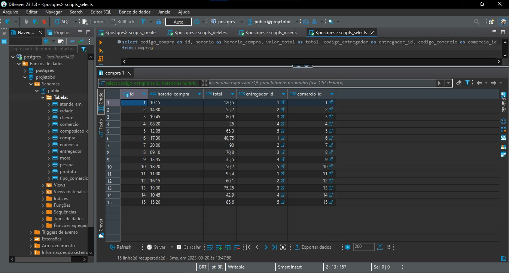

# Projeto de Banco de Dados - IFOOD

# Tabela de conteúdos

<!--ts-->

- [Sobre](#Descrição)
- [Diagrama Entidade-Relacionamento](#diagrama-entidade-relacionamento)
- [Mapeamento](#mapeamento)
- [Scripts](#scripts)
- [Consultas](#consultas)
- [Tecnologias](#tecnologias)
- [Autores](#autores)
  <!--te-->
   

### Sobre

Esse projeto tem como objetivo auxiliar a construção de um banco de dados no qual os dados serão estruturados, organizados e mantidos, referentes a um sistema de compras online e seus integrantes, utilizados em uma plataforma similar ao IFOOD.

O projeto irá simular uma plataforma de compras online de produtos dos tipos mais variados como comida, remédios e condimentos para pets, juntamente com os integrantes do processo, o cliente que faz o pedido, os comércios que fornecem os produtos de consumo, as cidades em que o serviço é ofertado e os entregadores que com seus meios de locomoção realizam a entrega dos produtos. 

### Diagrama Entidade-Relacionamento

A partir do levantamento de requisitos foi criado o modelo conceitual abaixo:

### Mapeamento

A partir do modelo conceitual, foi feito o mapeamento para o modelo lógico, resultando nas relações abaixo:

- Pessoa(<ins>Código_Pessoa</ins>, CPF, Nome, Telefone, E-mail);

- Cliente(<ins>Código do Cliente</ins>, Número_Cartão, Nome_Titular, Código_Segurança, Validade, #Código_Pessoa, #Código_Compra);

- Entregador(<ins>Código do Entregador</ins>, CNH, #Código_Pessoa);

- Comércio(<ins>Código_Comércio</ins>, CNPJ, Nome_fantasia, Razão_Social, Telefone, E-mail, Horário_Atendimento, #Código_Endereço, #Código_Tipo);

- Tipo_Comércio(<ins>Código_Tipo</ins>, Ramo_Comércio);

- Produto(<ins>Código_Produto</ins>, Nome, Descrição, Valor, #Código_Comércio);

- Cidade(<ins>Código_Cidade</ins>, Estado, País, Nome_Cidade);

- Endereço(<ins>Código_Endereço</ins>, CEP, Número, Rua, Complemento);

- Compra(<ins>Código_Compra</ins>, Valor_Total, Horário, #Código_Comércio, #Código_Entregador);

- Composição_Compra(<ins>Código_Composição</ins>, Valor_Unitário, Valor_Total, Quantidade, #Código_Compra, #Código_Produto);

- Mora(<ins>Código_Pessoa</ins>, Código_Endereço);

- Atende_Em(<ins>Código_Cidade</ins>, Código_Comércio);

Onde as variáveis sublinhadas correspondem as chaves primárias e as variáveis com # correspondem a variáveis estrangeiras.

### Scripts

Foram criados 4 scripts, um destinado a criação da base de dados juntamente com as tabelas, um destino a inserir dados nas tabelas, um destinado a remoção e destruição de itens/tabelas e um contendo as consultas.

Os dados inseridos foram coletados e randomizados com a ajuda do ChatGPT. Também foram criados dicionários de dados para cada relação encontrada.

### Consultas

Algumas imagens do banco de dados e algumas consultas realizadas:

Comando SQL:

1. select *
2. from produto;

Comando SQL:

1. select codigo_compra as id, horario as horario_compra, valor_total as total, codigo_entregador as entregador_id, codigo_comercio as comercio_id
2. from compra;

Comando SQL:

1. select prod.nome, Sum(prod.valor)
2. from produto as prod
3. group by prod.nome, prod.valor;

### Tecnologias
PostgreSQL, DBeaver e SQL.

### Autores

José Jeovah dos Reis Neto 
Norton Almeida Pontes 
Odiney Souza da Paixão 
Victor Hugo Moreira da Silva Souza (Whintters)